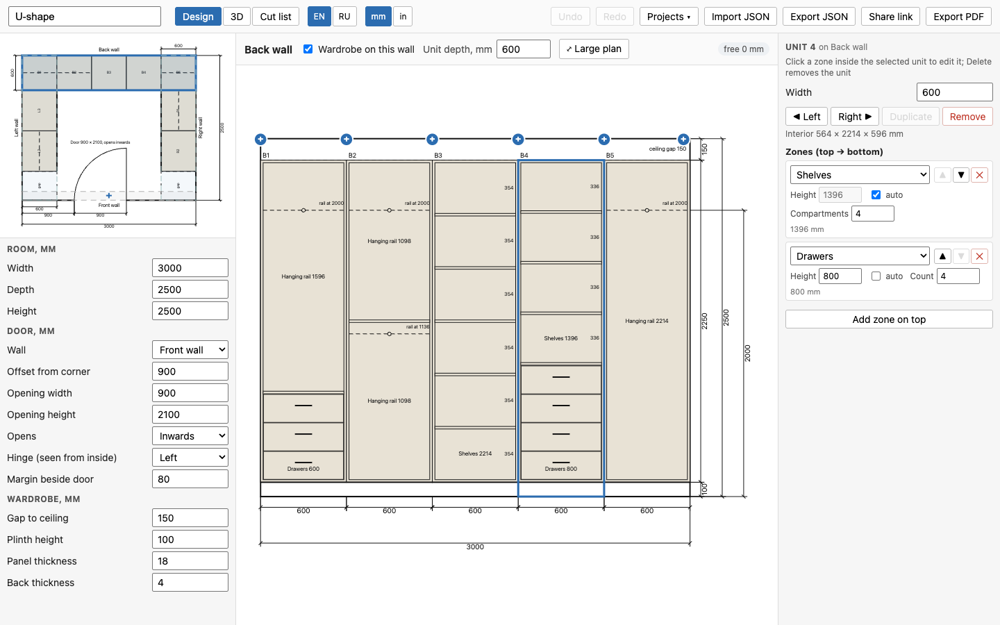
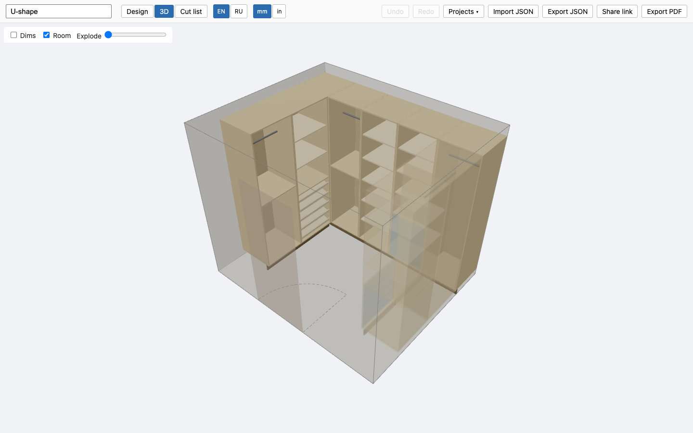
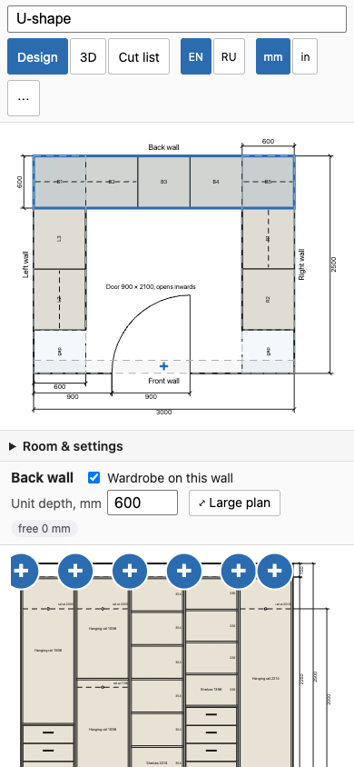

# Walk-in Planner

**<https://walkinplanner.com>** — free, runs in the browser, no account.

Plan a walk-in wardrobe: set the room and the door, pick which walls carry wardrobe, and fill
each wall with columns of hanging rails, shelves, drawers, shoe racks and open compartments — or
leave gaps. Out comes a 3D preview, a dimensioned plan with one elevation per wall, a cut list
every panel of which is tagged to the drawings, and a PDF you can hand to a panel shop.
Everything runs locally: projects live in your browser's storage, and a share link carries the
whole design in the URL rather than on a server.

## What it does

- Rectangular room, open (doorless) units along any of the four walls, one door opening.
- Columns of stacked zones: hanging, double hanging, shelves, drawers, shoe rack, open
  compartment — or an empty gap, optionally carrying a wall-mounted rail.
- 3D preview, dimensioned plan + per-wall elevations, cut list, PDF export.
- Millimetres or inches (display only — the model is always mm), English or Russian.
- Several projects side by side, JSON import/export, share links, undo/redo.

## What it does not

- **No doors on the units** — this plans an open walk-in by design.
- **No drawer boxes or hardware**: no runners, hinges, handles, edging or fixings. The cut list
  covers carcass panels, shelves, dividers, drawer *fronts*, plinths and rods only, so drawer box
  depths must be chosen from the unit's interior depth by hand.
- No non-rectangular rooms, no sloped ceilings, no pricing, no supplier catalogues.
- No server: nothing is uploaded, and nothing is backed up for you.

## Use

1. First run opens an example layout and a three-step hint bar (click a wall → press **+** →
   click a unit). Dismiss it once and it stays gone. **Projects ▾** in the top bar lists your
   projects and creates a new one blank or from a template (One wall, L-shape, U-shape);
   `/app/?template=uShape` opens straight into one.
2. **Design** tab: click a wall in the plan (top-left), then click a **+** in the wall elevation
   to insert a unit preset (long hanging, double hanging, shelves, drawers + hanging,
   drawers + shelves, shoe rack, open compartment, or an empty gap) at that position.
3. Click a unit to edit its width and zones (bottom→top stack) in the inspector; click a zone
   *inside the already-selected unit* to drill down to that zone. A shelves zone is sized in
   **compartments**, not boards: *n* compartments are split by *n* − 1 shelves, so `1` is a
   single open bay. `Delete` removes the selected zone when one is selected (never a unit's last
   zone) and the whole unit otherwise, `Esc` clears the selection, `Cmd/Ctrl+D` duplicates the
   unit, `Cmd/Ctrl+Z` undoes.
4. A **shoe rack** zone is a stack of boards tilted 15°, 350 mm deep (a shoe is about 300 mm
   long, so the board never reaches the back of the unit), each with a 40 mm lip along its front
   edge to stop shoes sliding off. Set the number of boards; the zone height divided by that
   count must stay at least 150 mm.
5. A **gap** can carry a *hanging rail (wall-mounted)* — the usual answer for the stretch a run
   has to leave free in a corner: tick it on the gap, pick a direction and a height above the
   floor, and the rod (but not its brackets) joins the cut list. No carcass is built. An *along*
   rail spans the whole empty stretch its gap sits in: the plain gaps beside it and, after the
   last column, the free rest of the wall, up to the next unit or the next wall — and on through
   a corner left for the neighbouring run when that run keeps the corner empty (a plain gap, or
   nothing, where it meets our wall). No need to size the gap to fit.
6. A hanging zone's rail runs **along the wall** by default; switch its *Direction* to
   **front to back (corner)** for a unit boxed into a corner, where a wall-parallel rail cannot
   be reached. The plan shows every rail as a dashed line, so the two read apart.
7. Room / door / wardrobe settings (gap to ceiling, plinth, panel thickness) are in the left
   panel. The **mm | in** toggle beside the language toggle switches every displayed length,
   including drawings, cut list and PDF; files stay in millimetres.
8. **3D** tab to orbit around the room; **Cut list** tab for the parts; **Export PDF** for the
   scheme (the 3D picture is rendered off-screen if you never opened the 3D tab).
9. **Share link** copies a URL with the whole project packed into the fragment — nothing is
   stored on a server. **Export JSON** / **Import JSON** move a project between browsers; an
   imported file always opens as a new project, so whatever you had open stays as it was.

The project autosaves to localStorage. The PDF embeds PT Sans (SIL OFL) so Russian text renders.

## Develop

    pnpm install
    pnpm dev          # landing http://localhost:5173/ , app http://localhost:5173/app/
    pnpm test         # vitest
    pnpm typecheck
    pnpm build        # typecheck + vite build -> dist/
    pnpm screenshots  # needs dist/: rewrites public/screenshots/*.png and public/og.png

`pnpm screenshots` drives the system Chrome headless over the DevTools protocol (no Playwright,
no extra dependency); set `CHROME` if Chrome is not at the default macOS path.

## Layout

- `index.html`, `ru/`, `guides/`, `site/` static marketing pages (landing in two languages, four
  guides) with their shared CSS and the page list a test checks
- `app/index.html` the planner itself, served at `/app/`
- `public/` static assets copied verbatim: `CNAME`, favicon, `robots.txt`, `sitemap.xml`,
  `llms.txt`, `og.png`, `screenshots/`
- `src/model` types, factory, presets, defaults, validation; `src/model/templates.ts` the three
  starter layouts
- `src/geometry` wall frames + segments, unit/zone layout, `Part[]` builder
- `src/cutlist`, `src/drawing`, `src/render`, `src/pdf` pure outputs derived from the model /
  `Part[]`
- `src/units.ts` mm/inch formatting and parsing (display only)
- `src/store` zustand store (history, selection), persistence, `projects.ts` (several projects in
  localStorage), `share.ts` (compressed share links)
- `src/ui` React components (Design tab editors, 3D viewport under `src/ui/three`,
  `three/offscreenSnapshot.ts` for the PDF picture without a 3D visit)
- `scripts/screenshots.mjs` the screenshot/og-image generator

Design specs: `docs/superpowers/specs/`.
Sibling project (same architecture): `../planner` (under-stairs closet planner).

## Deploy

Pushes to `master` build and publish to GitHub Pages via `.github/workflows/pages.yml`
(repository Settings → Pages → Source must be "GitHub Actions").

Custom domain: `public/CNAME` holds `walkinplanner.com`, so the site is served from the apex.
DNS at the registrar:

| type | name | value |
| --- | --- | --- |
| A | `@` | `185.199.108.153` |
| A | `@` | `185.199.109.153` |
| A | `@` | `185.199.110.153` |
| A | `@` | `185.199.111.153` |
| CNAME | `www` | `bynov.github.io` |

Then tick **Enforce HTTPS** in the repository's Pages settings once the certificate is issued.
